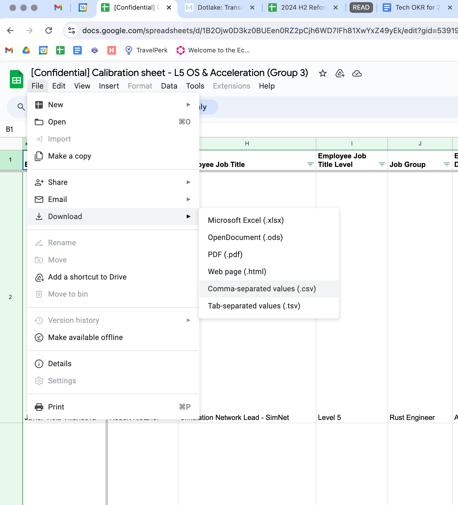
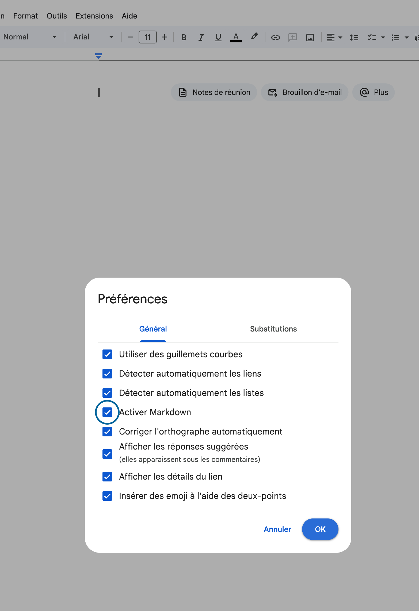
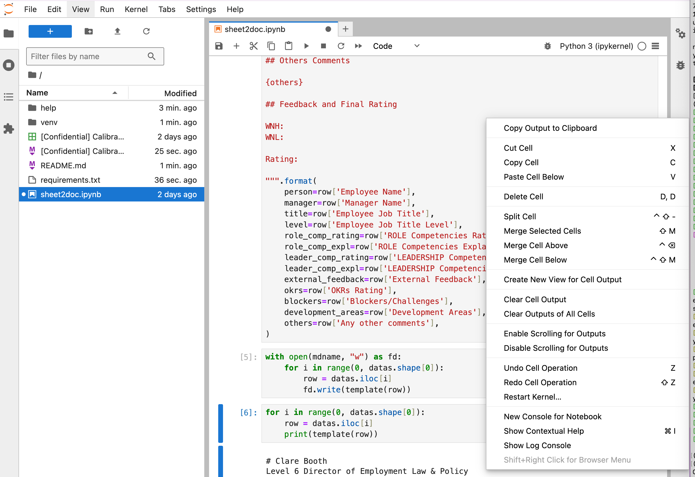

# How to convert a spreadsheet into a doc.

There is no trivial way but the proposed one takes 1 min end to end. Due to Parity setup of Google Cloud we cannot do it via automatic authentification etc so there are some manual steps.

## installation

you need a python interpreter on your machine.
if you are on linux:
```
python3 -m venv venv
source venv/bin/activate
pip3 install -r requirements.txt
jupyter-lab &
```

will get you started.

If you are on Windows: [Install Conda](https://docs.anaconda.com/miniconda/)
then in a PowerShell:
```
conda install jupyter
conda install pandas
```
## how to use

1. download the speadsheet in csv format
   - 
2. run the python script, it will generate a file in markdown format
   - change the sheetname in the second cell to match the one you want to change
   - you can easily add fields and change the output
3. create a new google doc and activate markdown support
  - navigate to docs.new
  - Tools -> Preference and turn on Markdown
  - 
4. copy all the markdown in the clipboard
  - 
5. right click and in the menu, you have copy markdown
6. done :)
